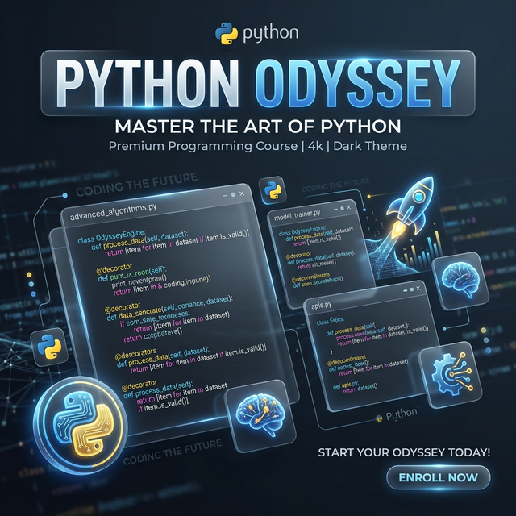

# 🐍 Curso de Python 3 - Mundo de Descobertas



## 🎓 Sobre o Curso
Este repositório contém todo o progresso, exercícios e desafios do **Curso de Python 3** do Canal **Curso em Vídeo**, ministrado pelo mestre **Gustavo Guanabara**.

> "Python é uma linguagem moderna, poderosa e extremamente versátil."

---

## 🚀 Estrutura do Aprendizado

O curso está organizado em **Mundos**, cada um explorando pilares fundamentais da programação:

### 🌍 [Mundo 1: Fundamentos](./cursoemvideo_python/Curso%20de%20Python%203%20-%20Mundo%201%20Fundamentos)
Focado no básico: instalação, tipos primitivos, operadores, manipulação de texto e condições simples.

### ⚙️ [Mundo 2: Estruturas de Controle](./cursoemvideo_python/Curso%20de%20Python%203%20-%20Mundo%202%20Estruturas%20de%20Controle)
Explora estruturas de repetição (for, while) e condições aninhadas para criar lógica complexa.

### 🧩 [Mundo 3: Estruturas Compostas](./cursoemvideo_python/Curso%20de%20Python%203%20-%20Mundo%203%20Estruturas%20Compostas)
Aprofundamento em Listas, Tuplas, Dicionários, Funções, Módulos e Tratamento de Erros.

### 🏛️ [Mundo 4: Programação Orientada a Objetos](./cursoemvideo_python/Curso%20de%20Python%203%20-%20Mundo%204%20POO%20Programação%20Orientada%20a%20Objetos)
Explorando o paradigma de POO em Python.

---

## 📊 Dashboard de Progresso (Local)

Criamos um dashboard interativo para você acompanhar seu progresso visualmente e acessar os arquivos com um clique.

### 🛠️ Como Executar:
1. Navegue até a pasta `dashboard`:
   ```bash
   cd dashboard
   ```
2. Instale as dependências:
   ```bash
   npm install
   ```
3. Rode o servidor de desenvolvimento:
   ```bash
   npm run dev
   ```

---

## 🛠️ Tecnologias Utilizadas
- **Linguagem:** Python 3
- **Controle de Versão:** Git & GitHub
- **IDE Sugerida:** PyCharm / VS Code

---

## 👤 Desenvolvedor
- **Nome:** [Seu Nome Aqui]
- **Status:** Em evolução... 🚀

---
*Este repositório serve como um portfólio de estudos e uma base de conhecimento para projetos futuros.*
